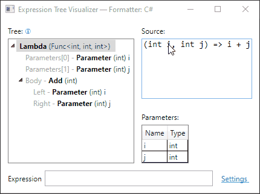

# Expression To String and Expression Tree Visualizer

[](https://ci.appveyor.com/project/zspitz/expressiontostring) [](https://ci.appveyor.com/project/zspitz/expressiontostring) [](https://www.nuget.org/packages/ExpressionTreeToString/) [](https://github.com/zspitz/ExpressionToString/releases)

This project provides the following:

* A .NET Standard library, with extension methods to [create a C# or VB.NET code-like string representation](https://github.com/zspitz/ExpressionToString#string-representations-of-expression-trees), of expression trees or expression tree parts (available as a [NuGet package](https://www.nuget.org/packages/ExpressionTreeToString/))
* A [debugging visualizer for expression trees / expression tree parts](https://github.com/zspitz/ExpressionToString#visual-studio-debugger-visualizer-for-expression-trees)  
  **Installation:** The visualizer DLL (2019 or 2017, depending on your VS version) and the dependent DLL (`MultiSelectTreeView.DLL`), from the [releases page](https://github.com/zspitz/ExpressionToString/releases), should be placed in the appropriate folder, as described [here](https://docs.microsoft.com/en-us/visualstudio/debugger/how-to-install-a-visualizer?view=vs-2017). It may be necessary to unblock the DLLs, and/or to put them in a `netstandard2.0` subfolder.For some troubleshooting suggestions, see [Torubleshooting visualizer installation](https://github.com/zspitz/ExpressionToString/wiki/Troubleshooting-visualizer-installation).
  
### Feedback

* Star the project
* File an [issue](https://github.com/zspitz/ExpressionToString/issues)

## String representations of expression trees

```csharp
Expression<Func<bool>> expr = () => true;

Console.WriteLine(expr.ToString("C#"));
// prints: () => true

Console.WriteLine(expr.ToString("Visual Basic"));
// prints: Function() True

Console.WriteLine(expr.ToString("Factory methods"));
// prints:
/*
    // using static System.Linq.Expressions.Expression

    Lambda(
        Constant(true)
    )
*/

Console.WriteLine(expr.ToString("Object notation"));
// prints:
/*
    new Expression<Func<bool>> {
        NodeType = ExpressionType.Lambda,
        Type = typeof(Func<bool>),
        Body = new ConstantExpression {
            Type = typeof(bool),
            Value = true
        },
        ReturnType = typeof(bool)
    }
*/

Console.WriteLine(expr.ToString("Textual tree"));
// prints:
/*
    Lambda (Func<bool>)
        Body - Constant (bool) = True
*/
```

Features:

* Multiple formatters ([with more planned](https://github.com/zspitz/ExpressionToString/issues/38)):

  * Pseudo-code in C# or VB.NET
  * Factory method calls which generate this expression
  * Object notation, using object initializer and collection initializer syntax to describe objects
  * Textual tree, focusing on the properties related to the structure of the tree

* Extension methods are rendered as instance methods

    ```csharp
    Expression<Func<int, int>> expr = x => Enumerable.Range(1, x).Select(y => x * y).Count();
    Console.WriteLine(expr.ToString("C#"));
    // prints: (int x) => Enumerable.Range(1, x).Select((int y) => x * y).Count()
    ```

* Closed-over variables are rendered as simple identifiers (instead of member access on the hidden compiler-generated class)

    ```csharp
    var i = 7;
    var j = 8;
    Expression<Func<int>> expr = () => i + j;
    Console.WriteLine(expr.ToString("C#"));
    // prints: () => i + j
    ```

* Type names are rendered using language keywords, instead of just the type name; e.g. `List<string>` or `List(Of Date)` instead of ``List`1``

* Special handling of calls to `String.Concat` and `String.Format`

    ```csharp
    var name = "World";
    Expression<Func<string>> expr = () => string.Format("Hello, {0}!", name);
    Console.WriteLine(expr.ToString("C#"));
    // prints: () => $"Hello, {name}!"
    ```

* Supports the full range of types in `System.Linq.Expressions`, including .NET 4 expression types, and `DynamicExpression`

## Visual Studio debugger visualizer for expression trees

The UI consists of:

1. a graphical treeview of the expression tree structure,
2. source code representation of the tree, and
3. end nodes -- nodes in the tree which are not composed of other expressions: parameters, closure variables, constants and default values


You can switch formatters without reloading the visualizer:


Selection syncing:

* when selecting from the tree:

  

* from source code:

  

* and from end nodes:

  
  
## Credits

* John M. Wright's series on [writing debugger visualizers](https://wrightfully.com/writing-a-readonly-debugger-visualizer)
* Multiple-selection treeview is provided by [MultiSelectTreeView](https://github.com/ygoe/MultiSelectTreeView)
* [ReadableExpressions](https://github.com/agileobjects/ReadableExpressions)
* [Greenshot](https://getgreenshot.org/) and [ScreenToGIF](https://www.screentogif.com/) for the screenshots
