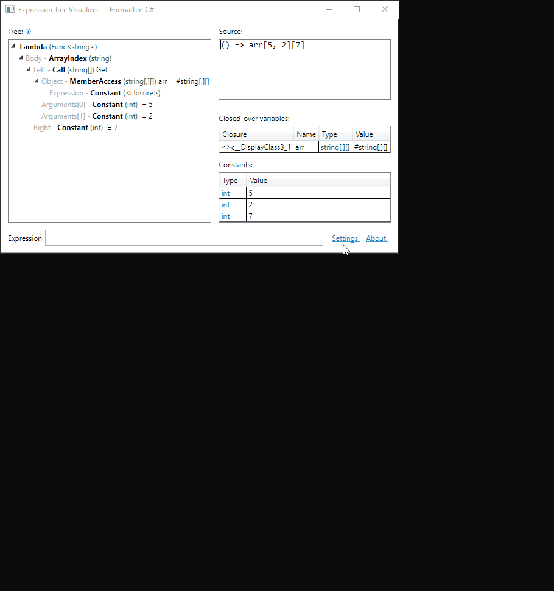
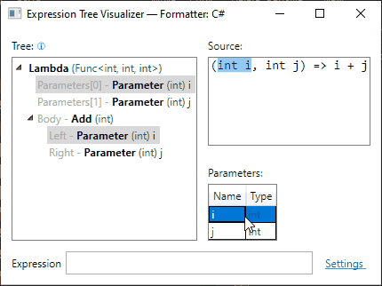

# Expression Tree Visualizer

> ExpressionTreeToString, the string representation library, has been moved [to its own repo](https://github.com/zspitz/ExpressionTreeToString). 

  

This project provides a custom debugging visualizer for expression trees that can be used with Visual Studio (on Windows). The UI consists of:

1. a graphical treeview of the expression tree structure,
2. source code representation of the tree, and
3. end nodes -- nodes in the tree which are not composed of other expressions: parameters, closure variables, constants and default values

You can switch formatters without reloading the visualizer:

Selection syncing:

* when selecting from the tree:

  

* from source code:

  

* and from end nodes:

  
  
# Installation

From the ZIP file corresponding to your Visual Studio version (2019 or 2017),

1. Unblock the ZIP file
2. Extract the files to the visualizers folder, preserving the [required folder structure](https://docs.microsoft.com/en-us/visualstudio/debugger/how-to-install-a-visualizer?view=vs-2019#to-install-a-visualizer-for-visual-studio-2019).

# Feedback

* Star the project
* File an [issue](https://github.com/zspitz/ExpressionToString/issues)

# Credits

* John M. Wright's series on [writing debugger visualizers](https://wrightfully.com/writing-a-readonly-debugger-visualizer)
* Multiple-selection treeview is provided by [MultiSelectTreeView](https://github.com/ygoe/MultiSelectTreeView)
* [ReadableExpressions](https://github.com/agileobjects/ReadableExpressions)
* [Greenshot](https://getgreenshot.org/) and [ScreenToGIF](https://www.screentogif.com/) for the screenshots
